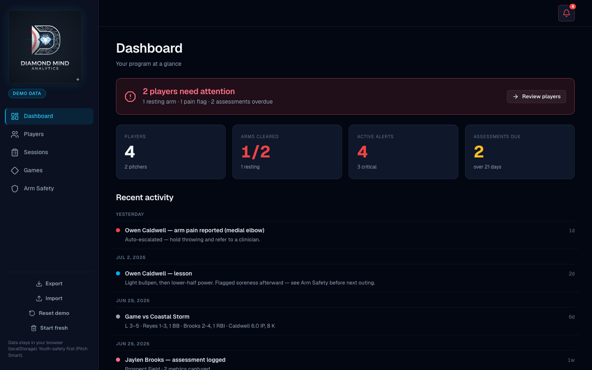

# Diamond Mind

A baseball player-development tracker — roster, drills, assessments, games, season stats, Pitch Smart arm safety, and training programs, right from your phone at the field.

**Live app:** [diamond-mind-coach.vercel.app](https://diamond-mind-coach.vercel.app)



## The honest story

I run a private baseball-coaching business with real clients, and I built Diamond Mind to manage them. It's the tool I actually wanted: add each player, log sessions and games, run assessments, and watch each player's development fill in over the weeks — with real age-band benchmarks and MLB/USA Baseball Pitch Smart rules doing the judging instead of my gut.

It's also a portfolio piece, so it ships with clearly-labeled sample players and a **Demo data** badge, so anyone opening the live link sees a populated, working app instantly. The sample data is honest placeholder data — not real client results. Hit **Reset demo data** any time to restore it, or **Export** your own data first.

## Features

The app is an 8-view single-page app (5 sidebar destinations + 3 routable hidden views):

- **Dashboard** — team status at a glance: recent activity, arm-safety flags, and alerts (alerts live here rather than in the nav).
- **Roster** — add / edit / delete players as flat cards (name, age, level, positions, throws/bats, notes).
- **Sessions** — log training sessions per player, with two child tabs:
  - **Drill library** — browsable drill catalog to build sessions from.
  - **Training programs** — assignable, age-gated program templates (hard age gates block e.g. weighted-ball work under 15) that auto-generate dated weekly sessions on assignment.
- **Games** — per-game batting / pitching / fielding stat lines, with a **Season** child tab that derives rate stats correctly (raw counters are the source of truth; rates are computed once from summed counters, never averaged per game).
- **Arm Safety** — MLB / USA Baseball **Pitch Smart** as a hard rule engine, not advice: clearance verdicts, days-until-eligible, today's remaining pitch allowance, rolling-12-month innings, consecutive-day warnings, and ACWR from logged workloads.
- **Player profile** (hidden view) — full development timeline, metric charts, and assessment history for one player.
- **Assessment entry** (hidden view) — structured metric readings (exit velo, pitch velo, 60-yard, pop time, bat speed, …) scored against **age-band percentile benchmarks** compiled from published youth-baseball datasets (Perfect Game, TopVelocity, Blast Motion, HitTrax, NSCA).
- **Alerts** (hidden view) — surfaced on the dashboard.
- **Your data, portable** — everything persists in `localStorage` via a versioned, immutable store; **Export JSON** / **Import JSON** so it's never trapped in one browser or device.
- **Mobile-first** — sidebar rail on desktop becomes a bottom tab bar on mobile; large tap targets, one-handed usable at the field.

## Tech stack

- Vanilla **HTML + CSS + JavaScript** — no framework, no build step, no npm.
- **Chart.js 4**, **SortableJS**, and **Lucide** icons via CDN.
- **localStorage** for persistence — a versioned, immutable data layer in `js/store.js` (flat collections keyed by foreign IDs, schema migrations included).
- Pure-function domain modules (`model.js`, `stats.js`, `pitchsmart.js`, `benchmarks.js`) with no DOM or storage dependencies.
- Views register themselves with a hash router; each render is try/caught so one broken view never blanks the app.

## Run locally

It's fully static — just open it:

```bash
open index.html
```

Or serve it (recommended, so the hash router behaves like production):

```bash
# Python 3
python3 -m http.server 8000
# then visit http://localhost:8000
```

No dependencies to install. No API keys required.

## Deploy to Vercel

This deploys with **zero config** because it's a static site.

1. Push this folder to a GitHub repo.
2. In Vercel: **New Project → Import** the repo.
3. Framework preset: **Other** (no build command, output is the repo root).
4. Click **Deploy**. Done.

### Environment variables

The current app needs **none** — there are no secrets and no API keys. A `.env.example`
is included only as a documented placeholder in case you later add an optional cloud-sync
integration. If you do:

1. `cp .env.example .env` and fill in real values locally (`.env` is git-ignored).
2. In Vercel → **Project Settings → Environment Variables**, add the same keys.
3. Never commit `.env`.

## Project structure

```
diamond-mind-coach/
├── index.html
├── assets/
│   ├── diamond-mind-logo.png       # source art (not loaded by the page)
│   ├── diamond-mind-logo-360.png   # optimized sidebar logo
│   ├── apple-touch-icon.png
│   └── favicon.png
├── docs/
│   └── screenshot-dashboard.png
├── css/
│   └── styles.css
├── js/
│   ├── constants.js      # shared constants + helpers
│   ├── sample-data.js    # clearly-labeled demo seed data
│   ├── store.js          # versioned, immutable localStorage data layer
│   ├── model.js          # entity factories, normalizers, age-band logic, validation
│   ├── stats.js          # pure baseball stats library (derived rate stats)
│   ├── pitchsmart.js     # Pitch Smart hard rule engine (clearance, ACWR)
│   ├── benchmarks.js     # age-band percentile reference table (sourced)
│   ├── programs-data.js  # age-gated training program templates
│   ├── io.js             # JSON export / import
│   ├── ui.js             # modal / toast / confirm helpers
│   ├── charts.js         # Chart.js progress charts
│   ├── app.js            # bootstrap + hash router + view registry
│   └── views/
│       ├── dashboard.js  # nav 1: status dashboard (+ alerts)
│       ├── players.js    # nav 2: roster
│       ├── sessions.js   # nav 3: sessions wrapper
│       ├── drills.js     #   child: drill library
│       ├── programs.js   #   child: training programs
│       ├── games.js      # nav 4: games
│       ├── season.js     #   child: season stats
│       ├── armsafety.js  # nav 5: arm safety
│       ├── player.js     # hidden: player profile
│       ├── assessment.js # hidden: assessment entry
│       └── alerts.js     # hidden: alerts
├── DESIGN_SYSTEM.md
├── CONTRACT.md
├── .env.example
├── .gitignore
└── vercel.json
```

## Privacy

All data stays in your browser's `localStorage`. Nothing is uploaded anywhere. Use **Export JSON** to back up or move your data between devices.
